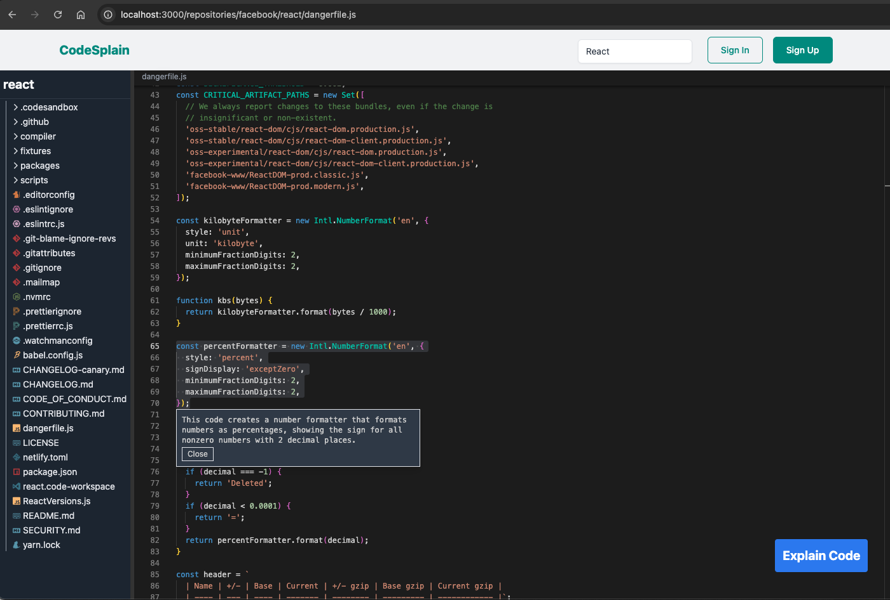
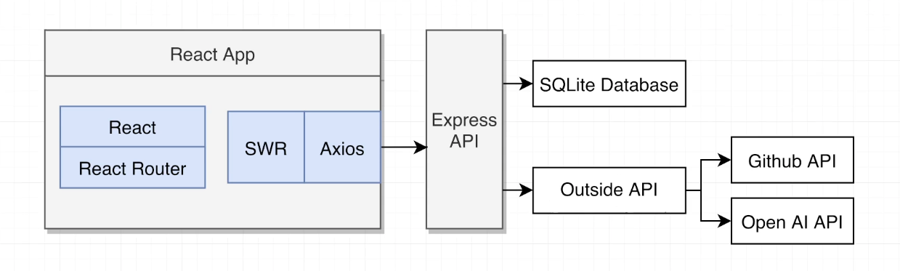

# Codesplain

_RTL_ practice project related to [React Testing Library and Jest: The Complete Guide](https://www.udemy.com/course/react-testing-library-and-jest) Udemy course by [Stephen Grider](https://www.udemy.com/user/sgslo).

Project uses _NPM_ as a package manager. Run `npm install` to install project dependencies and `npm run start` to run the project.

There are two separates servers running: _React_ development server ([localhost:3000](http://localhost:3000)) and API (port 8000, should be free).

## Business Logic

_Codesplain_ allows to do the search (e.g. search for _React_) over all the public repositories that are hosted on [GitHub](https://github.com). When user clicks on the repository from the list, he's taken to the code editor showing all the files and folders inside the repository. User can open any code file, highlight any code (e.g. function function expression) and click "Explain Code" button. User will get a popup with explanation of that code coming from code analyzing AI. The project also has some authentication stuff tied to it:

## The Tech

**Front-end**

Front-end is a classic _CRA_ generated application that uses _React_ and _React Router_ for navigation. Every time user browses or searches for different repositories, navigates to a repository or opens a folder or a file, data fetching is occurring. For data fetching _SWR_ and _Axios_ libraries are used:

- _Axios_ is used to fetch actual data
- _SWR_ is kind of coordination layer (it's taking data the has been fetched by _Axios_ and serving up or making it available to React components)

There's also a variety of different small libraries inside of the _React_ application (e.g. _Tailwind CSS_ for styling, a couple of icon libraries and so on).

**Back-end**

Back-end consists of _Express_ API running on port 8000 which handles things like authentication, storing data inside of a local _SQLite_ database (used in order not to have to set up more heavy duty database like _PostgreSQL_ or _MongoDB_). The _Express_ API is also making use of a second API, which is hosted on a public cloud server online. This outside API is providing access to the GitHub API and something open AI API (where code is being analyzed and a response with an explanation is being sent).
