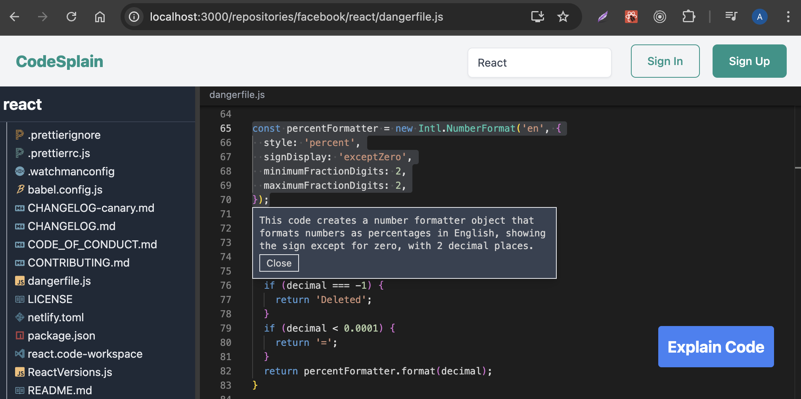

# Codesplain

RTL practice project related to [React Testing Library and Jest: The Complete Guide](https://www.udemy.com/course/react-testing-library-and-jest) Udemy course by [Stephen Grider](https://www.udemy.com/user/sgslo).

Project uses NPM as a package manager. Run `npm install` to install project dependencies and `npm run start` to run the project.

There are two separates servers running: React Development server ([localhost:3000](http://localhost:3000)) and API (port 8000, should be free).

## Business Logic

Codesplain allows to do the search (e.g. search for React) over all the public repositories that are hosted on [GitHub](https://github.com). When user clicks on the repository from the list, he's taken to the code editor showing all the files and folders inside the repository. User can open any code file, highlight any code (e.g. function function expression) and click **_Explain Code_** button. User will get a popup with explanation of that code coming from code analyzing AI. The project also has some authentication stuff tied to it:

## The Tech

Front-end is a classic CRA generated application that uses React and React Router for navigation. Every time user browses or searches for different repositories, navigates to a repository or opens a folder or a file, data fetching is occurring. For data fetching SWR and Axios libraries are used:

- Axios is used to fetch actual data
- SWR is kind of coordination layer (it's taking data the has been fetched by Axios and serving up or making it available to React components)

There's also a variety of different small libraries inside of the React application (e.g. Tailwind CSS for styling, a couple of icon libraries and so on).

Back-end consists of Express API running on port 8000 which handles things like authentication, storing data inside of a local SQLite database (used in order not to have to set up more heavy duty database like PostgreSQL or MongoDB). The Express API is also making use of a second API, which is hosted on a public cloud server online. This outside API is providing access to the GitHub API and something open AI API (where code is being analyzed and a response with an explanation is being sent).
